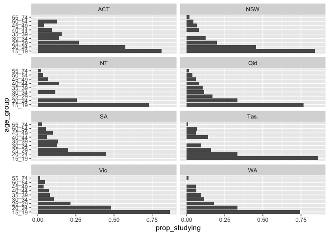
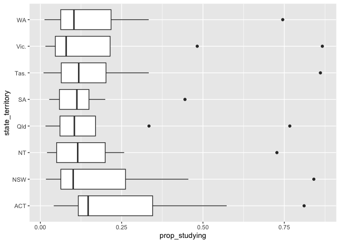

<!-- README.md is generated from README.Rmd. Please edit that file -->

# learned

<!-- badges: start -->

<!-- badges: end -->

The goal of learned is to demonstrate some cleaning tools for education
data.

## Installation

You can install the development version of learned from
[GitHub](https://github.com/) with:

``` r
# install.packages("pak")
pak::pak("njtierney/learned")
```

## Example

Let’s show an example of the raw education data:

``` r
library(learned)

raw_education_2014
#>    year state_territory age_group n_studying population prop_studying
#> 1  2014             ACT     15-19       19.3       23.8   0.810924370
#> 2  2014             ACT    20--24       18.1       31.6   0.572784810
#> 3  2014             ACT     25-29        9.4       34.9   0.269340974
#> 4  2014             ACT     30-34        4.5       32.8   0.137195122
#> 5  2014             ACT    35--39        4.5       28.7   0.156794425
#> 6  2014             ACT   40---44        2.6       28.4   0.091549296
#> 7  2014             ACT    45--49        1.0       24.2   0.041322314
#> 8  2014             ACT     50-54        3.0       24.0   0.125000000
#> 9  2014             ACT     55-74        2.1       67.2 -99.000000000
#> 10 2014             NSW     15-19      388.1      461.6   0.840771231
#> 11 2014             NSW   20---24      231.1      507.9   0.455010829
#> 12 2014             NSW   25---29      105.7      535.1   0.197533171
#> 13 2014             NSW    30--34       66.3      534.2   0.124110820
#> 14 2014             NSW   35---39       53.4      496.0 -99.000000000
#> 15 2014             NSW     40-44       40.9      523.8   0.078083238
#> 16 2014             NSW    45--49       33.5      482.3   0.069458843
#> 17 2014             NSW   50---54       22.0      499.6   0.044035228
#> 18 2014             NSW    55--74       25.7     1490.6   0.017241379
#> 19 2014              NT    15--19       11.2       15.4   0.727272727
#> 20 2014              NT     20-24        4.2       16.3   0.257668712
#> 21 2014              NT    25--29        3.5       20.1 -99.000000000
#> 22 2014              NT    30--34        2.3       20.0   0.115000000
#> 23 2014              NT    35--39        1.8       17.2 -99.000000000
#> 24 2014              NT   40---44        2.4       17.0   0.141176471
#> 25 2014              NT    45--49        1.0       15.1   0.066225166
#> 26 2014              NT     50-54        0.5       14.7   0.034013605
#> 27 2014              NT     55-74        0.7       34.0   0.020588235
#> 28 2014             Qld     15-19      234.5      305.8   0.766841073
#> 29 2014             Qld    20--24      110.7      331.4   0.334037417
#> 30 2014             Qld   25---29       58.0      342.1   0.169541070
#> 31 2014             Qld    30--34       38.2      329.5   0.115933232
#> 32 2014             Qld   35---39       32.5      310.5   0.104669887
#> 33 2014             Qld   40---44       26.2      337.2   0.077698695
#> 34 2014             Qld   45---49       18.6      308.0   0.060389610
#> 35 2014             Qld    50--54       12.2      314.6   0.038779402
#> 36 2014             Qld   55---74       14.5      912.9   0.015883448
#> 37 2014              SA    15--19       83.3      100.4 -99.000000000
#> 38 2014              SA   20---24       50.2      112.9   0.444641275
#> 39 2014              SA    25--29       23.0      115.2   0.199652778
#> 40 2014              SA    30--34       13.9      109.8   0.126593807
#> 41 2014              SA    35--39       13.7      103.2   0.132751938
#> 42 2014              SA     40-44        6.9      113.7   0.060686016
#> 43 2014              SA     45-49       11.0      112.0   0.098214286
#> 44 2014              SA     50-54        6.2      116.4   0.053264605
#> 45 2014              SA   55---74        9.9      361.7   0.027370749
#> 46 2014            Tas.    15--19       28.5       33.1   0.861027190
#> 47 2014            Tas.     20-24       10.6       31.8   0.333333333
#> 48 2014            Tas.    25--29        4.6       29.1   0.158075601
#> 49 2014            Tas.   30---34        2.8       29.3   0.095563140
#> 50 2014            Tas.   35---39        3.4       29.3 -99.000000000
#> 51 2014            Tas.   40---44        4.8       34.1   0.140762463
#> 52 2014            Tas.   45---49        2.0       34.2   0.058479532
#> 53 2014            Tas.     50-54        2.5       37.7   0.066312997
#> 54 2014            Tas.    55--74        1.2      121.4   0.009884679
#> 55 2014            Vic.   15---19      309.6      357.1   0.866984038
#> 56 2014            Vic.    20--24      199.5      413.6   0.482350097
#> 57 2014            Vic.    25--29       96.3      448.9   0.214524393
#> 58 2014            Vic.    30--34       46.7      438.5   0.106499430
#> 59 2014            Vic.    35--39       31.3      394.0   0.079441624
#> 60 2014            Vic.    40--44       30.7      416.5   0.073709484
#> 61 2014            Vic.   45---49       14.9      383.0   0.038903394
#> 62 2014            Vic.    50--54       17.5      379.1   0.046161963
#> 63 2014            Vic.    55--74       17.4     1114.8   0.015608181
#> 64 2014              WA   15---19      118.7      159.3   0.745134965
#> 65 2014              WA   20---24       61.9      185.8   0.333153929
#> 66 2014              WA    25--29       39.2      219.1   0.178913738
#> 67 2014              WA   30---34       23.1      201.3   0.114754098
#> 68 2014              WA     35-39       16.2      176.2   0.091940976
#> 69 2014              WA     40-44       11.9      186.9   0.063670412
#> 70 2014              WA    45--49       10.3      171.7   0.059988352
#> 71 2014              WA     50-54        9.1      169.7 -99.000000000
#> 72 2014              WA    55--74        6.0      466.0   0.012875536

tidy_age_state_education_2014 <- clean_education_data(
  raw_education_2014
)

tidy_age_state_education_2014
#> # A tibble: 72 × 6
#>     year state_territory age_group n_studying population prop_studying
#>    <dbl> <chr>           <fct>          <dbl>      <dbl>         <dbl>
#>  1  2014 ACT             15_19           19.3       23.8        0.811 
#>  2  2014 ACT             20_24           18.1       31.6        0.573 
#>  3  2014 ACT             25_29            9.4       34.9        0.269 
#>  4  2014 ACT             30_34            4.5       32.8        0.137 
#>  5  2014 ACT             35_39            4.5       28.7        0.157 
#>  6  2014 ACT             40_44            2.6       28.4        0.0915
#>  7  2014 ACT             45_49            1         24.2        0.0413
#>  8  2014 ACT             50_54            3         24          0.125 
#>  9  2014 ACT             55_74            2.1       67.2       NA     
#> 10  2014 NSW             15_19          388.       462.         0.841 
#> # ℹ 62 more rows
```

### Plot of the **proportion of people educated** in each age group in each state

``` r
plot_study_age_state(tidy_age_state_education_2014)
#> Warning: Removed 7 rows containing missing values or values outside the scale range
#> (`geom_col()`).
```



# Box plot of **proportion of people educated** for each state.

``` r
boxplot_study_state(tidy_age_state_education_2014)
#> Warning: Removed 7 rows containing non-finite outside the scale range
#> (`stat_boxplot()`).
```



# Table of The 5 number summary (min, 1st quantile, median, 3rd quantile, max) of **proportion of people educated** for each state.

``` r
summarise_prop_study(tidy_age_state_education_2014) |> 
  knitr::kable(digits = 3)
```

| state_territory | min_study | q1_studying | median_study | q3_studying | sd_study |
|:----------------|----------:|------------:|-------------:|------------:|---------:|
| ACT             |     0.041 |       0.117 |        0.147 |       0.345 |    0.272 |
| NSW             |     0.017 |       0.063 |        0.101 |       0.262 |    0.284 |
| NT              |     0.021 |       0.050 |        0.115 |       0.199 |    0.248 |
| Qld             |     0.016 |       0.060 |        0.105 |       0.170 |    0.237 |
| SA              |     0.027 |       0.059 |        0.112 |       0.149 |    0.134 |
| Tas.            |     0.010 |       0.064 |        0.118 |       0.202 |    0.279 |
| Vic.            |     0.016 |       0.046 |        0.079 |       0.215 |    0.284 |
| WA              |     0.013 |       0.063 |        0.103 |       0.217 |    0.241 |
